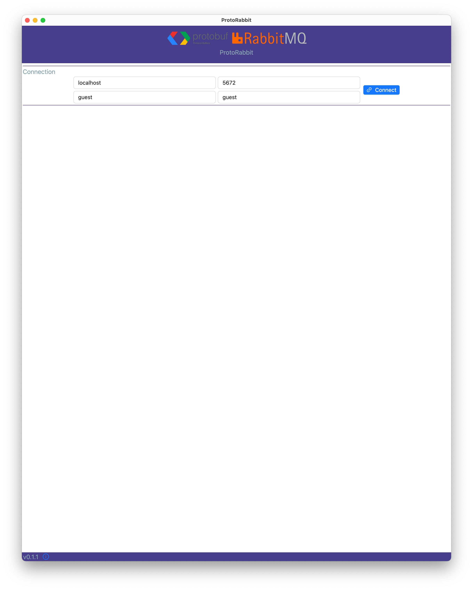
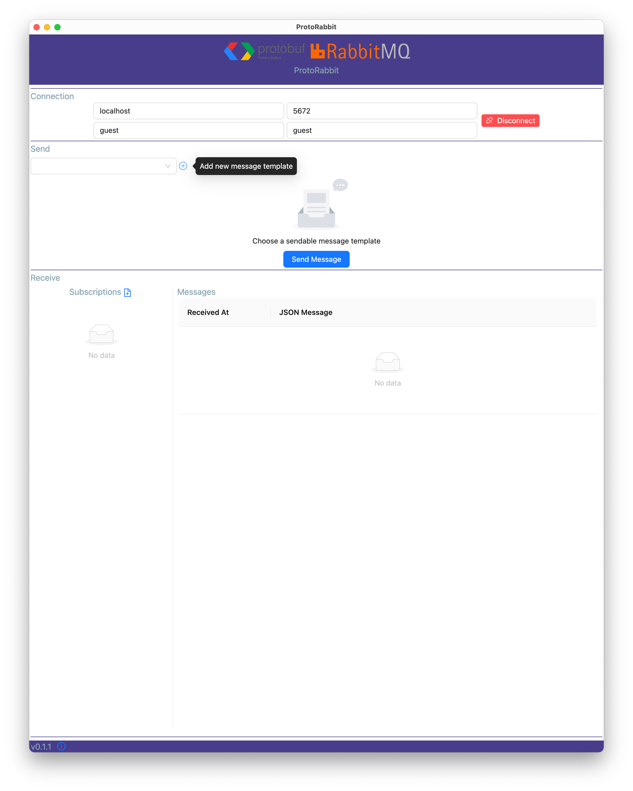
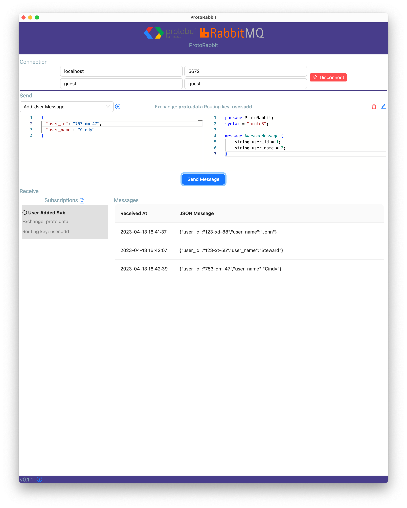

# ProtoRabbit

Electron desktop tool (macOS, Windows(untested) and Linux(untested)) for sending and receiving Protobuf serialized messages to/from RabbitMQ.
Protobuf messages are great for a microservice architecture, but they're harder to inspect while debugging so this tool takes care of deserializing and displaying them in JSON form.
It also allows manually defining a JSON message that is then serialized with Protobuf and sent to RabbitMQ.

### Note: I built this for my own needs and to learn Electron, ViteJs and Playwright.

## Build and Run

### RabbitMQ

To run it locally you need a RabbitMQ instance. If you already have one, then skip this section, otherwise continue reading.
The easiest way to get a running RabbitMQ instance is with Docker. I'm using this command

```bash
docker run -d -p 15672:15672 -p 5672:5672 -v $(pwd):/var/lib/rabbitmq --hostname my-proto-rabbit rabbitmq:3-management
```

Which does the following:

- exposes port `15672` to make the web interface accessible. You can log in with `guest/guest``
- exposes port `5672` which is the default port used to communicate with a RabbitMQ instance
- it maps the current working directory on my host to `/var/lib/rabbitmq` which persists data locally

### Node

I'm using Node 16

Look inside `package.json` to get a feeling, but basically you can start from the CLI with `npm run dev`. If you use VSCode, you can just choose the `Electron: all` configuration and press `F5`.

## Usage

### Connect

Enter the connection data to the RabbitMQ instance




### Define a Template for Sending Messages

If you want to send protobuf messages to RabbitMQ, then you have to define a new template for the messages that you'll be sending.
Click the little `+` icon in the Send section and provide the following data:

- name: a human readable name for you message template.
- exchange: the name of the exchange where the messages should be sent, e.g. `proto.data`
- routing key: the routing key to use for each message, e.g. `user.add`
- protofile: the protobuf definition to use to serialize your messages before sending them.
- message sample: just a sample message to get you going. Please use JSON to specify the sample.

#### Note #1: after creating the sendable message sample you might need to select it from the dropdown.

#### Note #2: When a sendable message template is selected, you can edit the JSON message (editor on the left hand side) and the click `Send Message`.

#### Note #3: Make sure that your JSON message is structurally compatible with the protofile that you defined. Also trailing commas after the last property of a JSON message is not allowed, the editor should inform you about this. You can always go and edit or delete message templates.


### Start a Message Subscription

If you want to receive protobuf messages from RabbitMQ, e.g. from a microservice, you have to define a new message subscription.
Click the `+` button in the Receive section and provide the following data:

- name: a human readable name to distinguish one subscription from another, e.g. `User Added Sub`
- exchange: the exchange where you want to receive messages from, e.g. `proto.data`
- routing key: the routing key of the messages that you want to receive, `user.add`
- queue name: the name of the queue to put the messages in when they arrive, e.g. `protorabbit.user.add`. They'll be consumed immediately.

#### Note: after creating the message subscription you might need to select it in the list.


That's it!

You are now set to send and receive messages.

