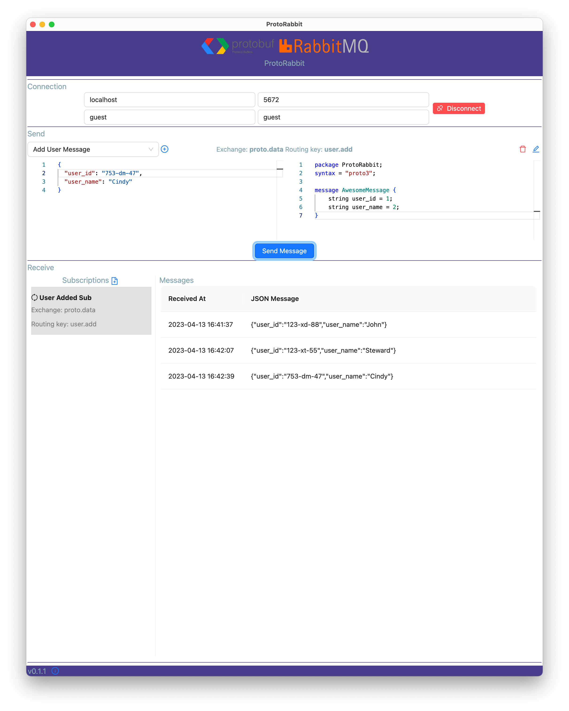

# ProtoRabbit

## What is it?

A cross platform desktop tool for sending and receiving Protobuf messages to/from RabbitMQ

When working with micro service based systems Protobuf is a good choice when performance is important. The downside is that protobuf serialized messages are not human readable, which makes debugging these systems hard.

ProtoRabbit is my little solution to this problem that affects me as well.

## Why two versions?

Besides working with micro services, I'm also interested in cross platform development, especially Xamarin/MAUI.

I started ProtoRabbit as a MAUI app just to keep up to date with the technology. Here's a little post where I shared my experience with MAUI https://www.linkedin.com/posts/mariusnm_github-mariusmunteanprotorabbit-net-activity-7033166716717146112-ccYm?utm_source=share&utm_medium=member_desktop

### MAUI App

[MAUI App README](README-MAUI.md)

### Electron App

Electron was never really on my radar and my little knowledge about it was "it is slow and uses a ton of RAM". But I was curious, and oh my was it glorious!
I used Electron + React + Typescript + ViteJs + AntD and I felt so productive. In my eyes the larger footprint of the app is completely balanced out by the excellent developer experience and by how performant the app turned out to be. MS Teams, Slack and Discord might be onto something 😃

[Electron App README](README-Electron.md)

There's no metrics regarding how much time I invested into each app version, but the Electron app has more feature, possibly due to the increased productivity.

### Fixes, Features and Future

Get in touch with me if you'd like to see new features or bugs fixed. PRs are always welcome 😁 but don't stress yourself about it.
I don't have plans to extend the app much, except if there's real demand for it. I'll concentrate on refactoring the code and adding more E2E tests.

As always, the code has a super permissive MIT license so you're welcome to play with it as much as you want!
