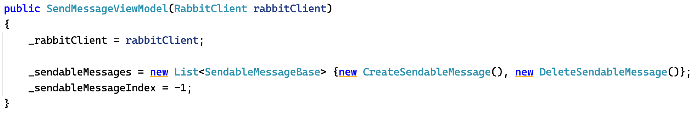

# ProtoRabbit

.NET MAUI desktop tool (macOS and Windows) for sending and receiving Protobuf serialized messages to/from RabbitMQ. 
Protobuf messages are harder to inspect while debugging so this tool takes care of deserializing and displaying them in JSON form.
It also allows manually defining a JSON message that is then serialized with Protobuf and sent to RabbitMQ.

### Note 1: I built this for my own needs and to test out MAUI.
### Note 2: You probably won't be able to use it as it. Have a look at the code and extend it with your message types. 

## Adding a new sendable message type
* Add a new class with the necessary Protobuf annotations.
* Add another class that inherits from `SendableMessageBase`. Here you describe to which exchange your new message should be sent, what routing key to use, what the message type should be and an optional JSON sample.

* Tell the `SendMessageViewModel` about the new SendableMessage.

## Adding a new receivable message type
* Add a new class with the necessary Protobuf annotations OR reuse the new class that you added for sending (see above).
* Add another class that inherits from `ReceivableMessageBase`. Here you describe from which exchange your new message should be received, what routing key to use and the deserialization target type.

* Tell the `NewSubscriptionViewModel` about the new ReceivableMessage.

## macOS and Windows UIs
|                                                                                                        |                                                                                                             |                                                                                                                    |
:-------------------------------------------------------------------------------------------------------:|:-----------------------------------------------------------------------------------------------------------:|:------------------------------------------------------------------------------------------------------------------:|
|  |  |  |

